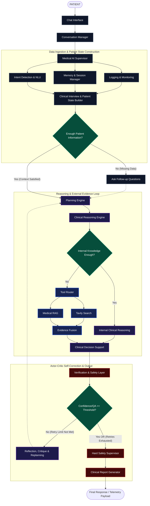

<div align="center">

# Clinical Triage Intelligence System

### A Multi-Agent Directed Acyclic Graph (DAG) for ESI Acuity Classification

[](https://www.python.org/)
[](https://github.com/langchain-ai/langgraph)
[](https://groq.com/)
[](https://docs.pydantic.dev/)

</div>

---

# Table of Contents

1. [Project Overview](#1-project-overview)
2. [System Architecture](#2-system-architecture)
3. [Clinical Protocol: ESI v4](#3-clinical-protocol-esi-v4)
4. [State Management & Memory](#4-state-management--memory)
5. [Installation Guide](#5-installation-guide)
6. [Execution Guide](#6-execution-guide)

---

# 1. Project Overview

This repository contains **Phase 1** of an enterprise-grade clinical decision support system. Built using **LangGraph**, the platform automates emergency department patient intake, performs structured medical information extraction, and classifies patient acuity according to the **Emergency Severity Index (ESI Version 4)** protocol.

Traditional medical Large Language Model (LLM) applications frequently encounter issues such as:

- Non-deterministic conversations
- State hallucination
- Inconsistent clinical reasoning
- Unverified medical assessments

To address these challenges, this project adopts a **Schema-Driven Multi-Agent Architecture**. Each clinical task is isolated into specialized graph nodes, enabling deterministic execution, strict validation, adversarial auditing, and hard safety enforcement before any triage recommendation is produced.

---

# 2. System Architecture

The system follows an **Actor-Critic Multi-Agent Architecture** implemented on a LangGraph `StateGraph`.

Execution state is globally shared while every mutation is validated using **Pydantic v2**, ensuring reliable state transitions and fault-tolerant routing.

## 2.1 Core Computational Boundaries

The pipeline is divided into three major execution boundaries:

- **Data Ingestion**
- **Clinical Inference**
- **Safety Enforcement**



## 2.2 Node Engine Heuristics

### 1. Semantic Resolution (NLU Extract)

Transforms free-text patient input into structured clinical data.

Features include:

- Named entity extraction
- Symptom normalization
- Zero-shot negation detection
- Automatic handling of null responses (e.g., "none")

---

### 2. State Preservation (Derailment Guardrail)

Protects the workflow against:

- Prompt injection attacks
- Emotional panic
- Requests for direct diagnosis
- Off-topic conversations

The node stabilizes the conversation while preserving graph state.

---

### 3. Deterministic Sequence Control (Planner)

Instead of allowing unrestricted conversation, the planner scans the current patient memory against an **11-field dependency matrix**.

It asks **exactly one missing question per iteration**, reducing patient cognitive load and ensuring deterministic execution.

---

### 4. Adversarial Critic (QA Auditor)

Reviews the Physician Agent output across three dimensions:

- Data Fidelity
- Protocol Alignment
- Clinical Safety

If validation fails, structured feedback is injected into the next reasoning cycle.

---

### 5. Fail-safe Enforcement (Safety Supervisor)

The final deterministic safety layer.

Responsibilities include:

- Hard safety overrides
- Preventing under-triage
- Retry exhaustion handling
- Automatic escalation to **ESI Level 2** when uncertainty persists

---

# 3. Clinical Protocol: ESI v4

The inference engine follows the official **Emergency Severity Index (ESI Version 4)** algorithm.

| ESI Level | Acuity | Clinical Criteria | Expected Resources |
|-----------|--------|------------------|-------------------|
| **Level 1** | Immediate | Apnea, pulselessness, severe respiratory distress, unconsciousness | Continuous resuscitation |
| **Level 2** | Emergent | High-risk situation, confusion, lethargy, severe pain | Immediate monitoring |
| **Level 3** | Urgent | Stable vital signs requiring multiple diagnostic or therapeutic resources | ≥2 Resources |
| **Level 4** | Less Urgent | Stable condition requiring one diagnostic or therapeutic resource | 1 Resource |
| **Level 5** | Non-Urgent | Stable condition requiring only examination or prescription refill | 0 Resources |

---

# 4. State Management & Memory

The LangGraph execution engine shares a strongly typed state using `TypedDict`.

Conversation history is accumulated through append-only reducers while every clinical payload is validated using **Pydantic**.

```python
class AgentState(TypedDict):

    # Conversation History
    messages: Annotated[list, add_messages]

    # Structured Patient Information
    patient_info: PatientInformation

    # State Flags
    ready_to_triage: bool
    requires_stabilization: bool
    supervisor_approved: bool

    # Runtime Variables
    next_question: str
    stabilization_response: str

    triage_evaluation: Optional[ESIEvaluation]
    audit_evaluation: Optional[TriageAuditorEvaluation]

    final_output: str

    # Telemetry
    language: str
    retry_count: int
```

---

# 5. Installation Guide

## Prerequisites

- Python 3.10+
- Git
- Groq API Key

---

## Clone Repository

```bash
git clone https://github.com/Maziar-0077/Medical-Agent.git
cd Medical-Agent
```

---

## Install Dependencies

```bash
pip install -r requirements.txt
```

---

## Configure Environment Variables

Create a `.env` file inside the project root.

```env
GROQ_API=your_groq_api_key_here
```


---

# 6. Execution Guide

The project supports two execution modes.

## 6.1 Command Line Interface (CLI)

Runs the LangGraph engine directly for debugging, testing, and state inspection.

```bash
python main.py
```

---

## 6.2 Streamlit Clinical Dashboard

Launch the interactive clinical dashboard with intake progress visualization and real-time state monitoring.

```bash
streamlit run app.py
```


